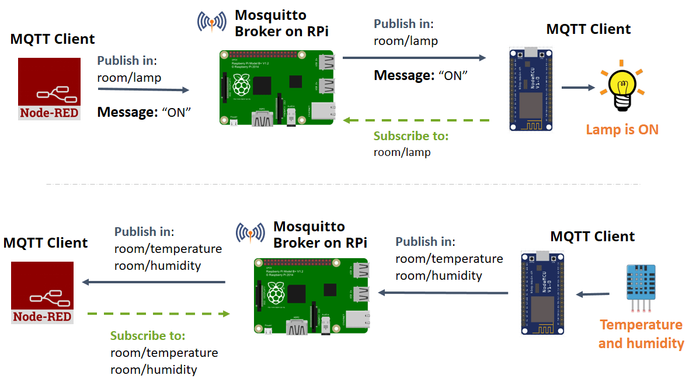

# IoT Technical Paper

## Introduction: What is IoT?

The “Internet of Things (IoT)” is a relatively new term for what most would consider old technology. We are used to things like sensors and motors, micro-controllers and bluetooth, but these are the technologies that when combined together make up the physical infrastructure of the Internet of Things. So to understand where the term came from and what it represents think of it as an increase in quantity and diversity of electronic things everywhere you can imagine. [The CEO of Softbank](https://venturebeat.com/2016/10/25/softbank-ceo-masayoshi-son-sees-a-future-with-1-trillion-internet-of-things-devices/) compared IoT to the [Cambrian explosion](https://en.wikipedia.org/wiki/Cambrian_explosion), when the Earths biological species evolved and diversified. the number and degree of interconnections between digital devices that make up the IoT ecosystem can be thought of similarly.

## Definition

We can generally think of IoT as three domains of technology. From these three types we can map where an IoT solution sits relative to the technology it is a descendant of. This can help technology decision makers compare solutions and gauge the maturity of an emerging product.

From those domains we can describe IoT generally as **industrial compute and control technology that is easy to build and use.**

## General Architecture

In order to build highly modular IoT systems it is useful to have a general architecture that includes the major components. This is by no means the only general architecture but it is highly modular and allows the IoT architect flexibility in the boards, sensors and communication interfaces they use.

bellow you can see a Micro-Controller that runs firmware for several sensors and sends that data via a wireless radio to a nearby raspberry pi that then sends that data to a cloud database while keeping a copy locally for use. One raspberry pi can act as a hub for many sensor nodes.

### Device Endpoints

#### Sensors

Sensors detect *events* as electrical signal in the physical world. Creating machines that can react to these various events and then communicate with other machines and take action"is unleashing a new wave of intelligent automation.

#### Actuators

Actuators are the mechanical and electrical control interfaces used by the micro-controllers and single-board computers. They can take direct and immediate *action* based on a variety of inputs and events

### Device Control

Device endpoints and the software that supports them should be designed following the principles of [control theory](https://en.wikipedia.org/wiki/Control_theory). For a good general introduction to control theory read this entry from the [Encyclopedia Britannica](https://www.britannica.com/science/control-theory-mathematics)

#### Micro-controller

Micro controllers are an important piece the design of IoT systems. They are ideal hosts for the logic that gathers the data from sensors to sends the signals to actuators. They send their data over a wired or wireless serial communication or network interfaces.

### Edge Computing

Where micro controllers are a gateway to the physical environment, computers are the hub between the one or many micro-controllers and the
internet.

When edge computing is not required this system module can be omitted and data routed directly to an internet service.

#### Single-Board computer

Single board computers contain all the necessary elements for running a desktop operating system. Memory, Storage, Computing and communication, all on a single board in a small form factor at a low cost compared to user workstation computers and laptops.

there are a great many other low cost single-board computers being made for use in the IoT ecosystem. Various configurations of memory, cpu power, interfaces and graphics processing make scaling concerns trivial if you can move your application onto any device.

#### Operating System

The operating system runs on the single board computer or in the cloud

In order to abstract software away from hardware requirements it is helpful to look at the technologies that have grown to maturity in the cloud ecosystem. Containerization, more specifically docker, is one technology that has grown to provide developers a tool for building application code that can run on one or many different devices. Balena.io has brought docker to IoT and at the time of this writing supports 27 single-board computers with more being added all the time.

[Read more about the Balena ecosystem](https://www.balena.io/what-is-balena)

#### Application Layer

The application runs on the single board computer or in the cloud.

In this context, the application layer refers to the space that either exists on the Microcomputer, or/and in some cloud service.

##### Node-RED

Node red is ideal for the rapid prototyping and development of IoT systems. It is very fast and simple for technical and non-technical users to configure and reconfigure flows.

In the above image we see that node red using the MQTT to get to two end devices, a sensor and a relay for a light. The diagram suggests that node-red is not running on the Raspberry Pi but in the cloud. It is also possible to run on the Pi itself or both the Pi and in a cloud instance. Node-red has its own API that can be used to manage many interconnected instances of node-red.

> Major problems to solve:
Data validation and signal integrity - In order to be a useful scientific tool the data must be validated. Good testing should be done in software to validate that the data is within expected tolerance for specific sensor.

### Network Layer

### Wired Communications

**Universal asynchronous receiver-transmitter** - A physical device that is commonly available in IoT devices for serialized communication.

**Inter-Integrated Circuit I$^2$C** - for communication between micro-controllers and other endpoints over wired serial lines. It is synchronous, addressable and packet switched making it ideal for use cases where you have many sensors communicating on the same message bus.

### Wireless Communication

There are a variety of wireless technologies that can be implemented. One example is the xbee radio: a low power, short range radio, communicates with the Zigbee protocol and is useful for machine to machine communication.

The Zigbee protocol standard has seen a great deal of adoption in the home automation sector. Zigbee adheres to the IEEE 802.15.4 specification for low data rate, wireless personal area network. What this means is that Zigbee is a standard that anyone can adopt and add devices that can communicate with others in the ecosystem.

## Links and related material

https://opensource.com/resources/open-science
https://opensource.com/business/13/6/four-types-organizational-structures-within-open-source-communities

http://www.open-electronics.org/bringing-open-source-tools-to-scientific-research-communities-open-science/?utm_content=buffer9b596&utm_medium=social&utm_source=facebook.com&utm_campaign=buffer

https://www.manylabs.org/

Research
http://www.sciencedirect.com/science/article/pii/S1084804516302922
http://www.sciencedirect.com/science/article/pii/B9780128053959000010
http://www.sciencedirect.com/science/article/pii/B9780124199712000029
http://www.sciencedirect.com/science/article/pii/S1084804516301618
http://www.sciencedirect.com/science/article/pii/B9780128038444000133
http://www.sciencedirect.com/science/article/pii/B9780128053959000150

Smart Farming (Mega Trend)
https://devpost.com/software/smarter-farming-v1xbkc

Definitions

https://en.wikipedia.org/wiki/Consumer_electronics
(https://en.wikipedia.org/wiki/Consumer_electronics#/media/File:Mobile_Phone_Evolution_1992_-_2014.jpg)